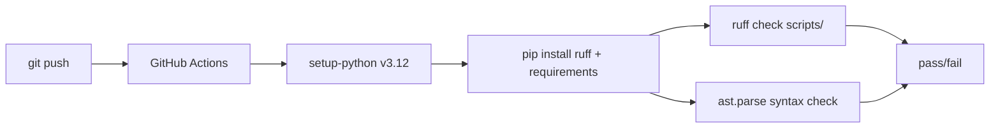

# ARCHITECTURE.md — mapa-contatos-historia

## 1. Introduction and Goals

### 1.1. Problem Statement

Brazil has no single, publicly audited directory of institutional contacts for History departments in public universities. Existing contact lists are often incomplete, out of date, or lack source transparency. Researchers, students, and institutional coordinators need a verifiable, documented map.

### 1.2. Solution

A data pipeline that:
- Reads official INEP microdata (Censo da Educacao Superior) to identify all Brazilian public universities and their History courses.
- Supports a documented manual verification workflow to collect and audit institutional email contacts.
- Produces auditable Excel workbooks with clear provenance, status, and caveats for every record.

### 1.3. Quality Goals

| Goal | Priority |
|------|----------|
| **Traceability** — every recorded contact must link to a verifiable public source with a timestamp. | High |
| **Accuracy** — the INEP-derived universe of universities and courses must match official data. | High |
| **Reproducibility** — the initial database (from INEP microdata) must be rebuildable by a single script. | High |
| **Integrity** — manual verification decisions are preserved, never overwritten by inference. | High |

### 1.4. Stakeholders

- **Researchers** in History needing contact information.
- **PET Historia USP** (project maintainers) auditing and updating contacts.
- **University administrators** whose contact channels are catalogued.

---

## 2. Constraints

| Constraint | Impact |
|------------|--------|
| INEP microdata (CSV) is not versioned in Git (files are hundreds of MB). | Users must download the ZIP manually; only the extraction/transform script is committed. |
| Contact collection is a manual process per university website. | Cannot be fully automated; the final spreadsheet cannot be script-generated end-to-end. |
| Target audience is non-technical (coordinators, admin staff). | Deliverable is an `.xlsx` spreadsheet, not an API or database. |
| MIT license for maximal reuse. | No restrictions on downstream use. |

---

## 3. Context and Scope

### 3.1. System Context

```
┌──────────────────┐     HTTP download      ┌─────────────────────┐
│  INEP Open Data  │ ───────────────────────>│  build_historia_    │
│  Portal          │                         │  universidades.py   │
│  (gov.br/inep)   │                         │                     │
└──────────────────┘                         └────────┬────────────┘
                                                       │
                                                       │ writes
                                                       ▼
┌──────────────────┐                          ┌─────────────────────┐
│  University      │                          │  base_auditavel_    │
│  Websites        │                          │  .xlsx              │
│  (manual review) │                          │  (6 sheets)         │
│                  │     manual notes         │                     │
│  ─────────────────────────────────────────> │  + manual edits →   │
│                  │                          │  mapeamento_...xlsx │
└──────────────────┘                          └─────────────────────┘
                                                       │
                                                       ▼
                                              ┌─────────────────────┐
                                              │  End users          │
                                              │  (researchers,      │
                                              │  coordinators)      │
                                              └─────────────────────┘
```

### 3.2. Scope / Business Context

**In scope:**
- Public Brazilian universities (`TP_ORGANIZACAO_ACADEMICA = 1`, `TP_REDE = 1`).
- History courses (excluding "Historia da Arte").
- Institutional contacts (secretariat, student section, department, coordination).
- Source URL, verification date, and caveats for each contact.

**Out of scope:**
- Private institutions.
- Non-university HEIs (centros universitarios, faculdades, IFs).
- Email inference by domain pattern.
- Contacts without public documentary evidence.

---

## 4. Solution Strategy

1. **Official source first** — the institution and course universe is defined exclusively by INEP's Censo da Educacao Superior.
2. **Script-based rebuild** — `build_historia_universidades.py` reconstructs the baseline from raw INEP CSVs.
3. **Documented manual audit** — contact collection follows a written methodology with pre-defined classifications (`Apurado`, `Apurado com ressalva`, `Nao encontrado`).
4. **Excel as output format** — selected for universal accessibility among non-technical users.
5. **Sprint-based verification** — organized in regional sprints (Norte/Centro-Oeste, Nordeste, Sudeste, Sul) for manageability.
6. **Git as audit trail** — intermediate spreadsheets are archived in `archive/sprints/`.

---

## 5. Building Block View

### 5.1. Level 1 — Repository Structure

```
mapa-contatos-historia/
├── scripts/
│   └── build_historia_universidades.py   # INEP microdata → Excel pipeline
├── docs/
│   ├── metodologia.md                    # Research methodology
│   ├── dados-e-reprodutibilidade.md      # Reproducibility guide
│   ├── estrutura-das-planilhas.md        # Spreadsheet layout reference
│   └── dicionario-de-dados.md            # Data dictionary
├── archive/sprints/                      # Intermediate snapshots
├── AGENT.md                              # Technical diary
├── ARCHITECTURE.md                       # This document
├── CONTRIBUTING.md                       # Contribution guide
├── requirements.txt                      # Python dependencies
├── .github/workflows/ci.yml             # CI pipeline (ruff lint + syntax check)
├── .gitignore
├── LICENSE                               # MIT
├── README.md                             # Bilingual project readme
├── base_auditavel_...xlsx                # Auditable baseline
└── mapeamento_contatos_...xlsx           # Final consolidated spreadsheet
```

### 5.2. Level 2 — Script Architecture

```
build_historia_universidades.py
│
├── CLI entrypoint (argparse)
│   ├── --output  (default: base_universidades_publicas_cursos_historia.xlsx)
│
├── load_public_universities()
│   └── Reads IES CSV → filters TP_ORGANIZACAO_ACADEMICA=1 & TP_REDE=1
│       → normalizes names → returns DataFrame
│
├── load_history_courses(public_ies_ids)
│   └── Reads CURSOS CSV (chunked for memory efficiency)
│       → filters by public IES IDs & "HISTORIA" course name
│       → excludes "HISTORIA DA ARTE"
│       → returns DataFrame
│
├── build_workbook(universities, courses, output)
│   ├── Merges universities + course counts
│   ├── Adds empty email columns for manual verification
│   ├── Creates 6 Excel sheets via pandas.ExcelWriter
│   │   ├── Resumo
│   │   ├── Universidades
│   │   ├── Cursos_Historia
│   │   ├── Pendencias_Email
│   │   ├── Sprints
│   │   └── Fontes
│   └── format_workbook() — openpyxl styling
│       ├── Header fill (blue #1F4E78), white bold font
│       ├── Frozen panes, auto-filter
│       ├── Dynamic column widths
│       └── Wrapped text + vertical top alignment
│
└── humanize_columns()
    └── Maps snake_case → Title Case with trailing acronyms preserved
```

### 5.3. Data Flow

```
INEP ZIP
  │
  ▼
MICRODADOS_ED_SUP_IES_2024.CSV  +  MICRODADOS_CADASTRO_CURSOS_2024.CSV
  │                                       │
  │  (chunked CSV read)                   │
  ▼                                       ▼
DataFrame: public_universities      DataFrame: history_courses
  │                                       │
  └─────────── merge on CO_IES ───────────┘
                        │
                        ▼
              Excel workbook (6 sheets)
                        │
                        ▼
              Manual contact verification
              (classified per methodology)
                        │
                        ▼
              Final spreadsheet:
              mapeamento_contatos_...xlsx
```

---

## 6. Runtime View

### 6.1. Baseline rebuild

```bash
# 1. Install Python 3.12+ and venv
python3 -m venv .venv
source .venv/bin/activate
pip install -r requirements.txt

# 2. Download INEP microdata ZIP and extract to:
#    data/raw/microdados_censo_da_educacao_superior_2024/dados/

# 3. Run the pipeline
python3 scripts/build_historia_universidades.py \
    --output base_universidades_publicas_cursos_historia.xlsx
```

### 6.2. Manual verification

1. Open the generated workbook.
2. For each university with History courses (`Pendencias_Email` sheet):
   - Visit the university's official website.
   - Locate the secretariat, student section, or department email.
   - Record email, source URL, and verification date.
   - Classify as `Apurado`, `Apurado com ressalva`, or `Nao encontrado`.
3. Consolidate into `mapeamento_contatos_institucionais_historia_universidades_publicas.xlsx`.

### 6.3. CI pipeline



---

## 7. Deployment View

No runtime deployment. The project is a data-processing pipeline that runs locally on the user's machine. Deliverables are Excel workbooks committed to the repository.

**CI:** GitHub Actions validates Python syntax and lint on push/PR to `main`.

---

## 8. Cross-cutting Concepts

### 8.1. Data Integrity

- University identification relies solely on official INEP codes (`CO_IES`).
- History course detection uses normalized uppercase comparison with regex boundary check (`\bHISTORIA\b`).
- "Historia da Arte" is explicitly excluded to avoid false positives.
- Manual verification adds emails; emails are never inferred or extrapolated.

### 8.2. Reproducibility

- `requirements.txt` pins major versions (pandas >=3, openpyxl >=3).
- Raw INEP data is not committed; download instructions are documented.
- The script produces deterministic output for the same input data.

### 8.3. Auditability

- Every contact record preserves: source URL, verification date, and caveat.
- Intermediate sprint snapshots are archived in `archive/sprints/`.
- The methodology document defines classification rules for all possible outcomes.

### 8.4. Non-technical Accessibility

- Output format is `.xlsx` (no database or API required).
- Column names are human-readable (Portuguese).
- Spreadsheets include formatting (frozen headers, auto-filter, wrapped text).

---

## 9. Architecture Decisions

| ADR | Decision | Rationale |
|-----|----------|-----------|
| **ADR-001** | Excel as output format | Universal accessibility for non-technical users; no app or API needed. |
| **ADR-002** | INEP as sole source for institution universe | Ensures completeness and reproducibility; INEP is the official Brazilian HEI registry. |
| **ADR-003** | Manual contact collection | Many university websites lack structured data; automated scraping would be unreliable and opaque. |
| **ADR-004** | Three-tier classification | `Apurado` / `Apurado com ressalva` / `Nao encontrado` captures uncertainty without false precision. |
| **ADR-005** | No email inference | Never derive emails from domain patterns to prevent inaccurate contacts. |
| **ADR-006** | Snapshots in Git | Intermediate spreadsheets are small; committing them preserves full audit trail. |

---

## 10. Quality Requirements

### 10.1. Quality Tree

```
Accuracy
├── Institution universe 100% matches INEP criteria
├── Course list matches INEP filtered criteria
└── No false positives from "Historia da Arte"

Auditability
├── Every contact has source URL + date
├── Every caveat is documented in Observacoes
└── Sprint archive preserves intermediate states

Reproducibility
├── Script rebuilds baseline from INEP CSVs
├── Deterministic output for same input
└── Dependency versions documented
```

### 10.2. Quality Scenarios

| Scenario | Measure |
|----------|---------|
| New INEP census released | Update year constant, re-run script, re-verify contacts |
| Auditor checks a contact | Must find source URL and verification date in the spreadsheet |
| User reports wrong email | Check Observacoes for caveats; flag methodology issue |
| New contributor | Must be able to rebuild baseline with one script |

---

## 11. Risks and Technical Debt

| Risk | Likelihood | Impact | Mitigation |
|------|-----------|--------|------------|
| INEP changes CSV format | Low | High | Year-specific constants; documented source format |
| University removes its contact page | Medium | Medium | Archived sprints preserve historical contact data |
| Large repo size (xlsx files) | Low | Low | Only final + audit files committed; raw INEP data excluded |
| Manual process depends on single person | Medium | High | Methodology documented; CONTRIBUTING.md encourages new verifiers |

---

## 12. Glossary

| Term | Definition |
|------|------------|
| INEP | Instituto Nacional de Estudos e Pesquisas Educacionais Anisio Teixeira |
| IES | Instituicao de Ensino Superior (Higher Education Institution) |
| Apurado | Verified contact found in official source |
| Apurado com ressalva | Contact found but with limitations (indirect, multi-campus, etc.) |
| Nao encontrado | No permanent official email found |
| Censo da Educacao Superior | Annual Brazilian higher education census by INEP |
| CINE | Classificacao Internacional Normalizada da Educacao (Cine Brasil) |
| Sprint | Regional verification batch (Norte/Centro-Oeste, Nordeste, Sudeste, Sul) |
