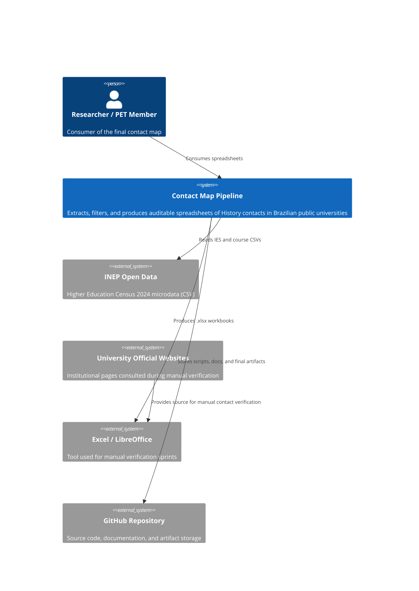
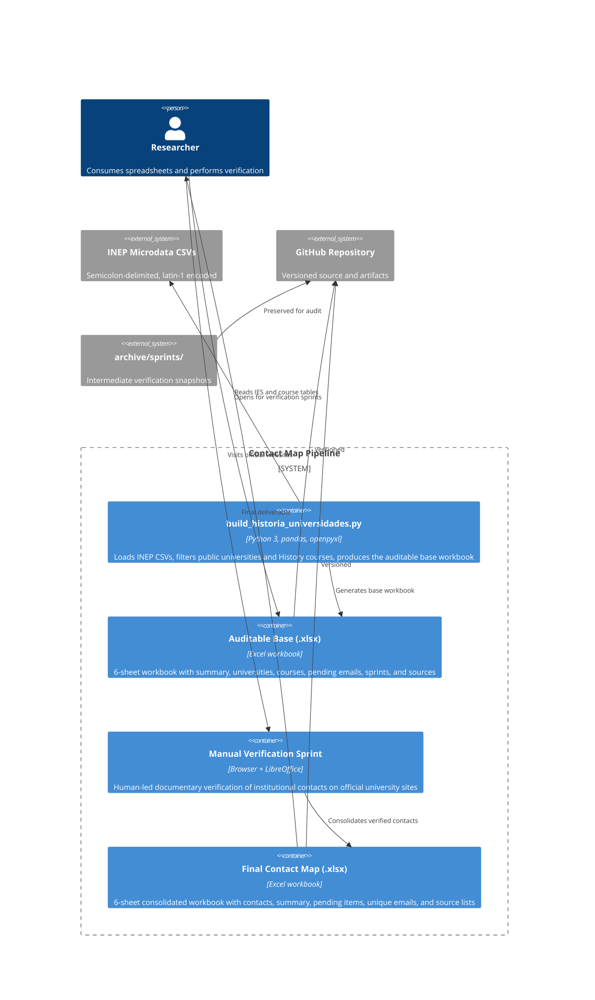
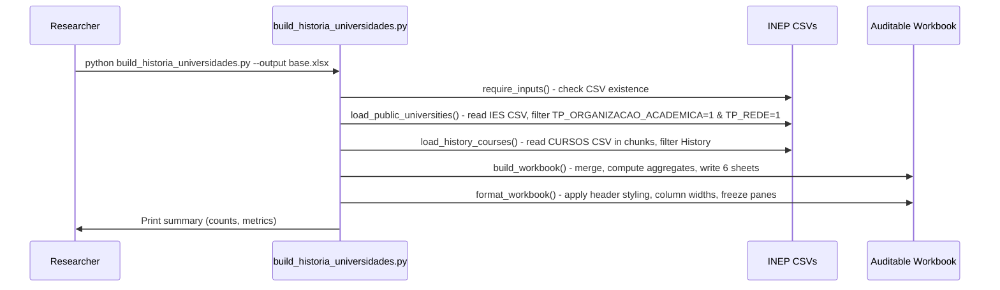
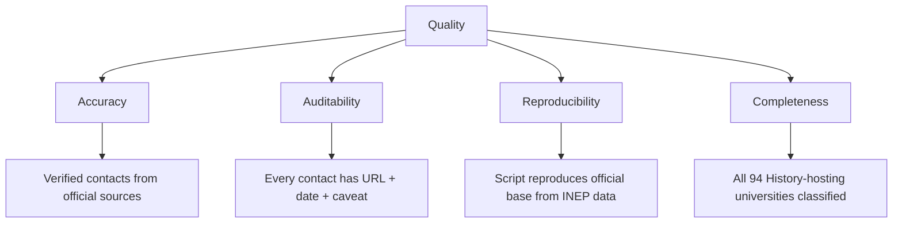

# Architecture Documentation: Mapa de Contatos Institucionais de Cursos de Historia

> arc42-lite | 12 sections | v1.0

---

## 1. Introduction & Goals

### 1.1 Problem Statement

Brazilian public universities maintain History courses with publicly visible institutional contacts, but there is no centralized, auditable mapping of these contacts. Existing approaches rely on ad-hoc lists, inferred email patterns, or non-public aggregators. Departments, researchers, and extension programs lack a verified, source-cited directory of History course secretariats, student sections, and departmental leadership.

### 1.2 Stakeholder Goals

| Stakeholder | Goal |
|---|---|
| PET Historia USP | Obtain verifiable institutional contacts for academic communication |
| History researchers | Access validated email channels for surveys, partnerships, and events |
| University administration | Be listed through official public channels only |
| Public data community | Reproduce the pipeline from INEP open data to final spreadsheet |

### 1.3 System Vision

A reproducible, auditable pipeline that:

1. Extracts Brazilian public universities from INEP Higher Education Census 2024 microdata
2. Identifies History courses within those universities
3. Produces a base spreadsheet for manual/semi-assisted documentary verification of institutional contacts
4. Delivers a final consolidated spreadsheet with source URLs, verification dates, and caveat annotations

---

## 2. Constraints

### 2.1 Technical Constraints

| Constraint | Rationale |
|---|---|
| Python 3.12+ required | pandas 3.x and openpyxl 3.x compatibility |
| INEP CSV microdata must be downloaded separately | Files are large (~hundreds of MB); not versioned in Git |
| Openpyxl as the sole Excel engine | Required for formatting, freeze panes, auto-filters, column widths |
| Latin-1 encoding for INEP CSVs | Official INEP encoding; must be handled explicitly |

### 2.2 Organizational Constraints

| Constraint | Rationale |
|---|---|
| Manual verification phase required | Contact accuracy depends on documentary evidence not reproducible by script alone |
| No email inference allowed | Emails must be sourced from institutional public pages; domain-pattern guessing is forbidden |
| Every contact must carry a source URL and verification date | Auditability requirement for academic rigor |
| MIT License | Open-sourced for reuse and verification by the academic community |

---

## 3. Context & Scope

### 3.1 System Context (C4 Context Diagram)



### 3.2 Scope

**Included:**
- Brazilian public universities (TP_ORGANIZACAO_ACADEMICA = 1, TP_REDE = 1 per INEP)
- History courses identified by normalized name matching
- Institutional contacts: secretariat, student section, department, coordination, center, institute
- Source URL and verification date for every contact

**Excluded:**
- Private institutions, university centers, isolated faculties, IFs, Cefets
- Art History courses (excluded by CINE_ROTULO filter)
- Inferred or domain-pattern-generated emails
- Contacts without public documentary evidence

---

## 4. Solution Strategy

### 4.1 Architecture Decisions at a Glance

| Decision | Choice | Alternative Considered |
|---|---|---|
| Data pipeline | Python script + manual verification | Fully automated scraping (rejected: institutional sites block bots, degrade auditability) |
| Output format | .xlsx with openpyxl formatting | CSV (rejected: lacks formatting, multi-sheet structure for audit trails) |
| Contact verification | Human researcher via browser | Automated email harvesting (rejected: ethical and legal concerns) |
| Version control | Git with INEP data excluded | Full data tracking (rejected: file size) |
| Documentation language | Portuguese (primary), English (contributing) | English-only (rejected: local academic context) |

### 4.2 Quality Strategy

- **Auditability:** Every contact has source URL, verification date, and caveat annotation
- **Reproducibility:** Script reproduces the initial official base from INEP microdata
- **Transparency:** Verification status uses three explicit categories (Apurado / Apurado com ressalva / Nao encontrado)
- **Traceability:** Intermediate sprint files preserved in `archive/sprints/`

---

## 5. Building Blocks (C4 Container Diagram)



---

## 6. Runtime View

### 6.1 Pipeline Execution



### 6.2 Verification Sprint Workflow

```mermaid
sequenceDiagram
  participant R as Researcher
  participant S as Sprint Workbook
  participant U as University Website
  participant F as Final Workbook

  R->>S: Open sprint workbook
  loop For each pending university
    R->>U: Navigate to institutional page
    U->>R: Display contact information
    R->>R: Evaluate source: origin, proximity, currency, sufficiency
    alt Contact found and adequate
      R->>S: Fill email, source URL, date; status = "Apurado"
    else Contact found with caveats
      R->>S: Fill email, source URL, date; status = "Apurado com ressalva"
      R->>S: Add caveat in observacoes
    else No permanent official contact
      R->>S: Status = "Nao encontrado"; justification in observacoes
    end
  end
  R->>F: Consolidate all sprints into final workbook
```

---

## 7. Deployment

### 7.1 Local Execution Environment

```
Workstation (Linux / macOS / Windows)
  |
  |-- Python 3.12 virtual environment
  |-- Dependencies: pandas, openpyxl
  |-- Local data/raw/microdados_censo_da_educacao_superior_2024/dados/
  |     |-- MICRODADOS_ED_SUP_IES_2024.CSV
  |     |-- MICRODADOS_CADASTRO_CURSOS_2024.CSV
  |
  |-- scripts/build_historia_universidades.py
  |-- Output: base_universidades_publicas_cursos_historia.xlsx
```

### 7.2 CI Pipeline

```yaml
Platform: GitHub Actions (ubuntu-latest)
Trigger: push / pull_request on main
Steps:
  1. Set up Python 3.12
  2. pip install ruff, pandas, openpyxl
  3. ruff check scripts/
  4. ast.parse verification of build script
```

---

## 8. Cross-cutting Concepts

### 8.1 Data Quality

| Concept | Implementation |
|---|---|
| Normalization | NFKD Unicode normalization, ASCII folding, uppercase for matching |
| Deduplication | Course-level dedup by CO_CURSO; email dedup in final consolidation |
| Validation | Basic email syntax check; verification status classification |
| Source integrity | URL + verification date required for every contact entry |

### 8.2 Error Handling

- Missing INEP CSVs produce a clear error with download instructions
- pandas chunksize=200000 for memory-safe processing of large course CSV
- Empty course data is handled gracefully (returns empty DataFrame)

### 8.3 Formatting Standards

- Header style: dark blue fill (1F4E78), white bold font, centered, wrap text
- Column width: dynamic min(12, max(len+2), 52)
- Freeze panes at row 2 for all sheets
- Auto-filter enabled on all sheets

### 8.4 Version Control Policy

| Artifact | Versioned | Rationale |
|---|---|---|
| Python scripts | Yes | Core pipeline |
| Documentation | Yes | Methodology, data dictionary, reproducibility |
| Final workbook | Yes | Primary deliverable |
| Intermediate workbooks | Yes | Audit trail in archive/sprints/ |
| INEP raw CSVs | No | Too large; publicly available |
| Cache/lock files | No | Transient |

---

## 9. Design Decisions (ADR)

### ADR-1: Manual Verification Over Automated Scraping

**Status:** Accepted  
**Context:** Contact data from 94 universities could theoretically be scraped.  
**Decision:** Use human-led documentary verification because institutional sites employ anti-bot measures, CAPTCHAs, JavaScript-rendered email protection, and non-standard layouts. Automated scraping would produce incomplete or inaccurate results and raise legal/ethical concerns.  
**Consequences:** Slower, but auditable and academically defensible. Every email has a human-verified source URL.

### ADR-2: Two-Workbook Architecture

**Status:** Accepted  
**Context:** The project produces both an auditable base and a final contact map.  
**Decision:** Maintain separate workbooks -- `base_auditavel_*.xlsx` (the raw pipeline output before manual work) and `mapeamento_contatos_*.xlsx` (the consolidated final deliverable). Intermediate sprint files are archived in `archive/sprints/`.  
**Consequences:** Clear separation between reproducible script output and human-verified data. Slightly more files to manage, but each has a distinct purpose.

### ADR-3: Email Non-inference Principle

**Status:** Accepted  
**Context:** Common pattern is to infer email addresses from institutional domains (e.g., secretaria@domain.uf.br).  
**Decision:** Never infer or complete emails by domain pattern. Only record emails found in official institutional pages.  
**Consequences:** Fewer total emails, but every recorded email is verified. Data remains defensible under academic scrutiny.

### ADR-4: Three-tier Verification Status

**Status:** Accepted  
**Context:** Contact quality varies; binary found/not-found is insufficient.  
**Decision:** Use three statuses: "Apurado" (adequate), "Apurado com ressalva" (found with caveats), "Nao encontrado" (not found after thorough search).  
**Consequences:** More nuanced data quality signal. Caveats are explicitly documented in the observacoes field.

---

## 10. Quality Scenarios

### 10.1 Quality Tree



### 10.2 Quality Scenarios

| Scenario | Metric | Target |
|---|---|---|
| New researcher reproduces the base | Pipeline runs with INEP CSVs | < 5 min setup, same results |
| Contact accuracy audit | Random sample check against sources | 100% of sampled contacts match source |
| University coverage | All 94 History-hosting universities classified | 100% classified |
| Caveat transparency | Records with caveats documented | 100% of caveats have observacoes text |
| Email validity | Syntax check pass rate | 100% of recorded emails pass basic syntax check |

---

## 11. Risks & Technical Debt

### 11.1 Risks

| Risk | Likelihood | Impact | Mitigation |
|---|---|---|---|
| INEP changes CSV format or encoding | Low | High | Pin to 2024 census; document required columns |
| University sites restructure removing contact pages | Medium | Medium | Archive source URLs; use verified date; mark as ressalva |
| Protection methods (Cloudflare, JS anti-spam) increase | High | Medium | Document in observacoes; mark as ressalva; note workaround |
| INEP stops publishing microdata | Low | High | Preserve the last known base; document alternatives |

### 11.2 Technical Debt

| Item | Description | Priority |
|---|---|---|
| No automated tests | Script lacks unit/integration tests | Medium |
| CSV encoding hardcoded | latin-1 assumed; may break with future INEP releases | Low |
| Column name mapping duplicated | `humanize_columns` duplicates mapping logic | Low |
| Verification status not enforced by schema | Stored as free text; typos possible | Low |

---

## 12. Glossary

| Term | Definition |
|---|---|
| IES | Instituicao de Ensino Superior (Higher Education Institution) |
| INEP | Instituto Nacional de Estudos e Pesquisas Educacionais Anisio Teixeira |
| Censo da Educacao Superior | Brazilian Higher Education Census, published annually by INEP |
| TP_ORGANIZACAO_ACADEMICA | INEP variable for academic organization type (1 = University) |
| TP_REDE | INEP variable for network type (1 = Public) |
| CINE Brasil | Brazilian classification system for educational programs (based on ISCED) |
| Apurado | Verification status: adequate contact found |
| Apurado com ressalva | Verification status: contact found but with documented limitations |
| Nao encontrado | Verification status: no permanent official contact located |
| HTR | Handwritten Text Recognition |
| OCR | Optical Character Recognition |
| GLAM | Galleries, Libraries, Archives, Museums |
